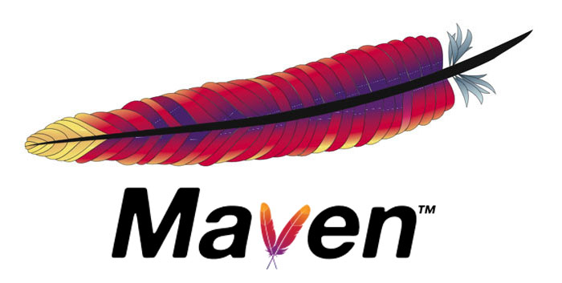

<div align="center" id="top"> 
  

  &#xa0;

  <!-- <a href="https://mavenserverautomation.netlify.app">Demo</a> -->
</div>

<h1 align="center">Maven As a Build Tool</h1>

<p align="center">
<div align="center">
  
  [](https://github.com/devenes/maven-server-automation/actions/workflows/pages/pages-build-deployment)       

  <!--  -->

  <!--  -->

  <!--  -->

</div>
</p>

<!-- Status -->

<!-- <h4 align="center"> 
	🚧  Maven Server Automation 🚀 Under construction...  🚧
</h4> 

<hr> -->

<p align="center">
  <a href="#dart-about">About</a> &#xa0; | &#xa0; 
  <a href="#rocket-technologies">Technologies</a> &#xa0; | &#xa0;
  <a href="#white_check_mark-requirements">Requirements</a> &#xa0; | &#xa0;
  <a href="#checkered_flag-starting">Starting</a> &#xa0; | &#xa0;
  <a href="#memo-license">License</a> &#xa0; | &#xa0;
  <a href="https://github.com/devenes" target="_blank">Author</a>
</p>

<br>

## :dart: About ##

Purpose of the this hands-on project is to have the understanding about how to use Maven with Java as a build tool.

## :rocket: Technologies ##

The following tools were used in this project:

- [Java](https://www.java.com/en/download/)
- [Maven](https://maven.apache.org/)
- [Git](https://git-scm.com/)
- [Terraform](https://www.terraform.io/)

## :white_check_mark: Requirements ##

Before starting :checkered_flag:, you need to have [Java](https://www.java.com/), [Maven](https://maven.apache.org/) and [Git](https://git-scm.com/) installed.

## :checkered_flag: Starting ##


### Learning Outcomes

At the end of the this hands-on training, you will be able to;

- install Maven and Java-11 on Amazon Linux 2 EC2 instance

- explain various build phases of a Java Application

- use Maven's clean, compile, package, install and site commands


## Outline

- Part 1 - Launch Amazon Linux 2 EC2 Instance with Cloudformation Template

- Part 2 - Generate a Java application using Maven's Archetype Plugin

- Part 3 - Run Maven Commands


## Part 1 - Launch Amazon Linux 2 EC2 Instance and Connect with SSH

- Launch an EC2 instance using ```maven-java-template.yml``` file located in this folder.
    - This template will create an EC2 instance with Java-11 and Maven.

- Connect to your instance with SSH.

- Check if you can see the Maven's binary directory under ```/home/ec2-user/```.

- Run the command below to check if Java is available.

```bash
java -version
```

- Cat ```~/.bash_profile``` file to check if Maven's path is correctly transferred. If not paste the necessary lines manually.

```
# Append the lines below into ~/.bash_profile file by making necessary changes.
M2_HOME=/home/ec2-user/<apache-maven-directory-with-its-version>
export PATH=$PATH:$M2_HOME/bin
```

- Run the command below to check if mvn commands are available.

```bash
mvn --version
```

- If not, run the command below and wait for the EC2 machine to get ready.

```bash
sudo reboot
```

## Part 2 - Generate a Java application using Maven's Archetype Plugin

- Run the command below to produce an outline of a Java project with Maven.

```bash
mvn archetype:generate -DgroupId=com.devenes.maven -DartifactId=maven-experiment -DarchetypeArtifactId=maven-archetype-quickstart -DinteractiveMode=false
```

- Cd into the project folder.

- Run the command below to be able to use tree command.

```bash
sudo yum install -y tree
```

- Run the command below to show the directory structure of the project.

```bash
tree
```

- Go into the folder where App.java resides and ```cat``` the auto generated ```hello world``` application in Java.

- Replace the content of the App.java file with the content of the App.java file in this repo.

- Go into the project's root folder.

- Replace the content of the ```pom.xml``` file with the content of the pom.xml file in this repo.

- Since we've install Java-11 on the EC2 machine, uncomment the ```properties``` tag of the new pom.xml file.

- Explain that the ```maven.compiler.source``` property specifies the version of source code accepted and the ```maven.compiler.target``` generates class files compatible with the specified version of JVM.

- Explain that ```dependencyManagement``` section in the pom file will import multiple dependencies with compatible versions.  


## Part 3 - Run Maven Commands


>### mvn compile
 
- Run the command below.

```bash
mvn compile
```

- Go into the folder ```<project-root>/target/classes/``` and show the class file.

- Run the command below to show how to test a Maven project.


>### mvn clean test

```bash
mvn clean test
```

- Show that there is a new folder named ```target``` in the project root. 

- inspect the target folder with tree command.

- Show the content of the file ```<project-root>/target/surefire-report/com.devenes.maven.AppTest.txt``` as the output of the test.

>### mvn package

- Run the command below.

```bash
mvn clean package
```

- Go into the folder ```<project-root>/target/``` and show the ```maven-experiment-1.0-SNAPSHOT.jar``` file as the output of the ```mvn package``` command.

- Run the command below to start the application.

```bash
java -jar maven-experiment-1.0-SNAPSHOT.jar
```

- Explain the error in the standard output. 
    - Maven's jar file is not an executable jar file. The jar file does not have both the ```Main Class``` and the necessary packages to run the application. 

- Add the plugin below to the pom file and run ```mvn clean package``` command again.

```xml
<build>
  <plugins>
    <plugin>
      <groupId>org.apache.maven.plugins</groupId>
      <artifactId>maven-assembly-plugin</artifactId>
      <executions>
          <execution>
              <phase>package</phase>
              <goals>
                  <goal>single</goal>
              </goals>
              <configuration>
                  <archive>
                  <manifest>
                      <mainClass>
                          com.devenes.maven.App
                      </mainClass>
                  </manifest>
                  </archive>
                  <descriptorRefs>
                      <descriptorRef>jar-with-dependencies</descriptorRef>
                  </descriptorRefs>
              </configuration>
          </execution>
      </executions>
    </plugin>
  </plugins>
</build>
```

```bash
mvn clean package
```

>### Run The Application

- Now, open up a fresh terminal on your local computer and run the command below.

```bash
scp -i <path-to-your-pem-file> -r <path-to-your-home-directory>/.aws ec2-user@<IP-of-your-instance>:/home/ec2-user/
```

- Check if the the credentials are transferred to EC2 instance.

- Go into your target folder.

- Run the command below to start the application. This time we are running the executable jar file with suffix ```jar-with-dependencies```.

```bash
java -jar maven-experiment-1.0-SNAPSHOT-jar-with-dependencies.jar
```

- Explain what the application does in the background.
    - Note that to be able see the object and the S3 bucket, we should comment the lines 142 and 150.

>### mvn install

- Run the command below to install our own package into .m2 folder.

```bash
mvn install
```

- Go into ```~/.m2/repository``` folder and show where our package is installed.

>### mvn site

- Add two more plugins to run the command ```mvn site```

```xml
<plugin>
    <groupId>org.apache.maven.plugins</groupId>
    <artifactId>maven-site-plugin</artifactId>
    <version>3.7.1</version>
</plugin>
<plugin>
    <groupId>org.apache.maven.plugins</groupId>
    <artifactId>maven-project-info-reports-plugin</artifactId>
    <version>3.0.0</version>
</plugin>
```

- Run the command below.

```bash
mvn clean site
```

- Show the output ```site``` directory under target directory.

- Run the command below to install Apache Server.

```bash
sudo yum install -y httpd
sudo systemctl start httpd
sudo systemctl enable httpd
```

- Run the command below to copy the contents of the site folder under ```/var/www/html``` folder.

```bash
sudo cp -a site/. /var/www/html
```

or start the server with the command below.

```bash
python3 -m http.server     
```

## Run the Application on AWS

```java
java -jar maven-experiment-1.0-SNAPSHOT-jar-with-dependencies.jar 
```

- Output:


```bash
===========================================
Getting Started with Amazon S3
===========================================

Creating bucket my-first-s3-bucket-d7b250f9-be4d-4534-bc22-9c32d83dc3b1

Listing buckets
 - cf-templates-1qe8zcgon5jhvi2-us-east-1
 - my-first-s3-bucket-d7b250f9-be4d-4534-bc22-9c32d83dc3b1
 - terraform-12321env-bucket

Uploading a new object to S3 from a file

May 26, 2022 2:19:30 PM com.amazonaws.util.Base64 warn
WARNING: JAXB is unavailable. Will fallback to SDK implementation which may be less performant.If you are using Java 9+, you will need to include javax.xml.bind:jaxb-api as a dependency.
Downloading an object
Content-Type: text/plain
    abcdefghijklmnopqrstuvwxyz
    01234567890112345678901234
    !@#$%^&*()-=[]{};':',.<>/?
    01234567890112345678901234
    abcdefghijklmnopqrstuvwxyz

Listing objects
 - MyObjectKey  (size = 135)

Deleting an object

Deleting bucket my-first-s3-bucket-d7b250f9-be4d-4534-bc22-9c32d83dc3b1
```

## :memo: License ##

This project is under license from Apache. For more details, see the [LICENSE](LICENSE) file.


Made with :heart: by <a href="https://github.com/devenes" target="_blank">devenes</a>

&#xa0;

<a href="#top">Back to top</a>
